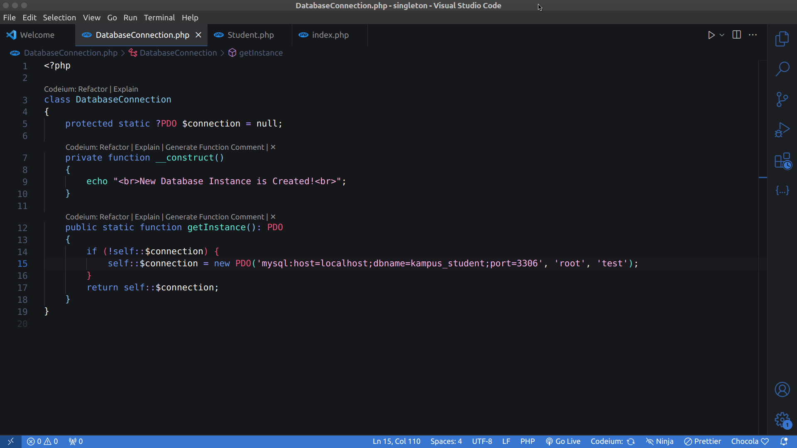
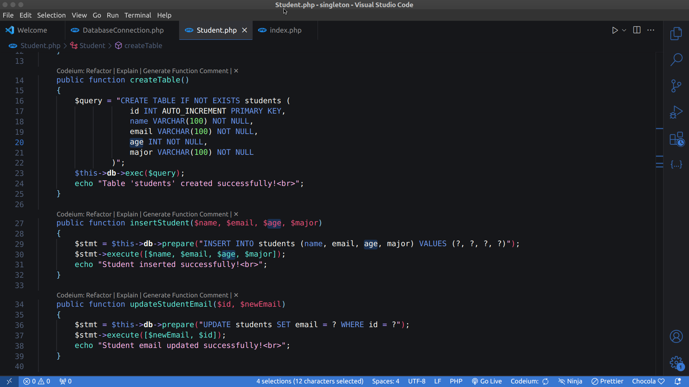
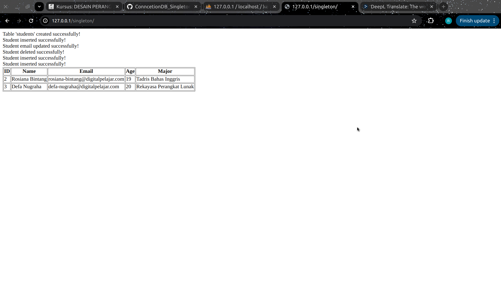

# TUGAS SINGLETON

```
Nama    : Defa Nugraha
NIM     : 2205008
KELAS   : D4 RPL2A
```

### Membuat Koneksi Database


Terdapat class DatabseConnection untuk membuat koneksi database dan method getInstance() untuk memastikan bahwa hanya satu objek koneksi database yang dibuat dan digunakan selama aplikasi dilanjakn.

### Membuat Class Student


berisi method untuk menampilkan, dan CRUD data students. Disini terdapat transaksi database lebih dari satu kali

### Pengujian


